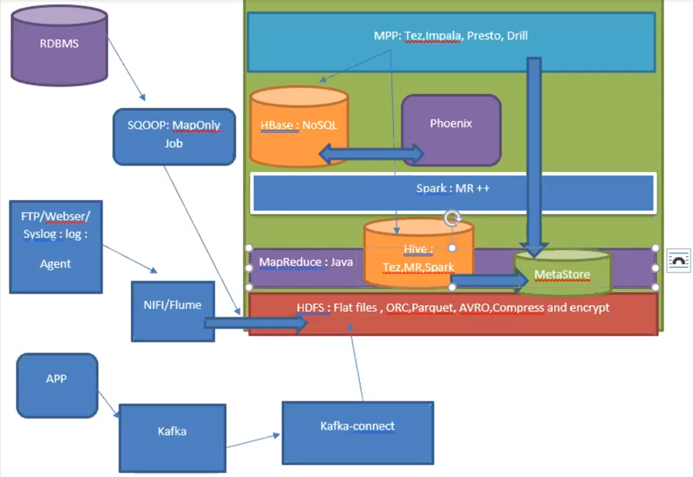

## RDBMS
RDBMS: Best to ensure ACID properties.

1. Atomicity: Operations and Transactions are atomic. Hold Locks to ensure this.
Issue: Locking and scalability are opposite, scalabilty is compromised.

2. Consistency: Normalization, Keep one data at one place only, don't put it in multiple tables. (Referential Integrity)
Issue: If a particular record is kept only at one place, that particular system(machine) will be bottleneck [ex: I/O Exhausted], Scalability is compromised. [Replication is a solution]

3. Isolation: Transactions are isolated with each other. T1/T2 are serialized isolation if both are write ops, else one can chose from read commited (or) read uncommited.

4. Durability: All databases write to RAM, but won't get effected on power failure or process failure. It is done using some sort of logging....eg: WAL. logging is not costly because it is sequential write, whie direct write to DB would be random IO.


If data is too big in PBs and TBs, Cluster is needed.
Cluster:
1. Single Master - Multiple Worker
2. Multiple Master - Multiple Worker
3. Masterless


Apple uses Cassendra DB using 1.75 lacs machines in a cluster for ITunes.
Netflix/Prime use data to DBs not to FileSystem.
Depending on Device/Network they read from DBs convert them to HDR files and then serve data using those files. (Also caches them to CDNs)


1. Single Master - Multiple Worker:
Single Master will be responsible to provide the locks but will become bottleneck.
This will impact Availability(what if master goes down) and Scalability(One node(master node) can provide only limited number of locks)

Availability can be improved by using one extra StandBy Master.


2. Multiple Master - Multiple Worker
Here each master should communicate with each other to inform about locks given by them. But network failure may lead to delay/loss of this information and two master can give lock of same variable to two different clients. This may lead to data inconsistency. So this is not used in financial Systems.


...............................................................
Sales: create table sales(.....) partition by (country) 
In case of any aggregation, option will be to run query on multiple partitions and move the result to one of the node for further aggregation.
This is not feasible over network for very big tables.
So, Normalisation is a villian for Big Data.

NoSQL data will use Denormalization Concepts.
...............................................................


Big Data Problems:

I. Storage:
    A. File System: HDFS, S3, Azure data lake, GCS
    B. Databases:
        NoSQL (Weakness: Transaction Management, Strength: Availability/Scalability)
            a) KeyValue
                For Employees table if we make empid as the key, only empid can be used to fetch the data, 
                if we want to fetch data using empName or phone, we'll need secondary indexes
                Eg: Redis, Riak, DynamoDB (keyval + document)
            b) Document DBs
                Json {} | Flexible Schema | Language agnostic
            c) Columnar DBs : HBase
            d) GraphDB : Neo4J
    C. Message queue or PubSub
    D. Search Engine
        Elastic Search / Apache Solr
    
II. Processing:
    A, Distributed & Paraller
        MapReduce & Spark

III. Visualization:
    Reporting Layer / Business Intelligence / Application Server 

--------------------------------------------------------------------------------

HDFS: Distributed file system of Hadoop
[Flat files | Extensions: ORC, Parquet, Avro | Can Compress, Can Encrypt]
NameNode: Master of HDFS and stores metadata of HDFS' files and directories.
DataNode: Worker Process, data will be stored as block(default size: 128 MB(big chunk size to reduce I/O count), default replication factor: 3) [Linux Block Size is 4 KB]

Ex: 1 GB file (test1.csv): 8 blocks * 128 MB (8 I/O will be enough to read whole data)

NameNode will know, 
Block A: Stored at DN1, DN3, DN6 (if rack awareness is configured, these DNs will be on different racks)
B: DN2, DN4, DN7


1. Data from DataSource to HDFS
--------------------------------------------------------------------------------
RDBMS => HDFS   |   SQOOP: Is a utility to import data from RDBMS to HDFS in batch and runs MapOnly job in background. | Uses JDBC connection
FTP => HDFS     |   NIFI/Flume: Can process record level data from FTP server/Webserver (Syslog: log) and put them to HDFS.
Kafka => HDFS   |   Kafka-connect: Can read from kafka and write to HDFS


2. HDFS to Structuring
--------------------------------------------------------------------------------
MapReduced


2. Hive (A dataware house, not a DB): Apache Tez, MapReduce, Spark (If data is already structured)
- Uses a mini database called MetaStore to store Table Information, will be available to other hadoop components.
--------------------------------------------------------------------------------
To Convert data to Table

2. Spark is MapReduce++


HBase: [NoSql, No Query, No Joins, No Txn Management, No Secondary Indices]
PHOENIX (A tool: Kind of JDBC layer on HDFS) : Will allow above operations.

In Hadoop, there is a layer MPP(Massively Parallel Processing Layer): Tez, Impala, Presto, Drill (They'll use MetaStore of Hive Itself)
Can run interactive query on Hive and Hbase Tables

Spinup Hadoop on VMWare

1. Download Ambari HDP file 
2. Download VMWare
3. Set network as bridge
4. Start VMWare with that HDP image
5. Now post completion do SSh using provided IP
6. ssh root@<ip> -p 2222
7. Default password is hadoop
8. Set some new password like Spark@123
9. You'll enter into the shell
10. ambari-admin-password-reset
11. reset the password to admin


SSH Inside the ambari system:

```
# Create a dir /data
hdfs dfs -mkdir /data

# Copy install.log from system to hdfs
hdfs dfs -put install.log /data

# Verify if file is present
hdfs dfs -ls /data

# Verify content of file if it is updated or encrypted
hdfs dfs -cat /data/install.log

# Metadata command of hadoop for a given directory
hdfs fsck /data -files -blocks -locations -racks

# dir for map reduce, this contains lots of jars
cd /usr/hdp/2.4.0.0-169/hadoop-mapreduce/

# run map reduce jobs (wordcount program is already written in this jar)
yarn jar hadoop-mapreduce-examples.jar wordcount /data /wc_out

# verify output folder
hdfs dfs -ls /wc_out

# An empty file with name _SUCCESS is created to tell job succeeded.
# One part file for each reducer is generated

hdfs dfs -cat /wc_out/part-r-00000
```

====================Some Interface description at 03:04:30======03:11:00======================

In Hadoop Cluster:

1. Master Node
   A. NameNode - Active [Stores metadata of HDFS]
   B. NameNode - StandBy 
   C. ResourceManager - Active [For any sort of jobs, resource approval is given by this, this is for YARN]
   D. ResourceManager - StandBy
   E. HMaster - Active [Master of HBase, if it is down, HBase will work but create/delete/alter table won't work]
   F: HMaster - StandBy

2. Management Nodes:
    A. Ambari
    B. Grafana

3. Data Nodes / Worker Nodes
   A. DataNode process, it is worker process of HDFS
   B. NodeManager (worker process of yarn), will run on same machine
   C. RegionServer is worker process of HBase, It will also run on same machine

4. Edge Node
   Kafka / Sqoop / Flume / NIFI

6. Client Node (for user interaction)
   Hive, MRClient, SparkClient, HBase Thrift, Hbase rest, Oozie

7. Gateway:
    Apache Knox : WEB-HDFS

8. Zookeeper Quorum [to manage above nodes]
    A. ZK0
    B. ZK1
    C. ZK2


Zookeeper will write data into disk in a datastructure called ZNode.
Zookeeper is the election commissioner, it conducts election for itself and then for other nodes.
Zookeeper provides content repository, to store configuration information
Zookeeper also implements Observer pattern, so any ZNode data can be subscribed and notified.

YARN - Yet Another Resource Negotiator


Map Reduce:


03:37